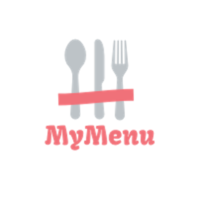

# MyMenu

Everyday, at lunch time, it's the same problem: where to eat? 

Whether it's because the days menu or the price range, whenever we want to pick a restaurant it's a cumbersome task. To address this problem we propose MyMenu. 

This solution is composed by two main features: 
a backoffice area where a restaurant can manage its account and post their menus daily; 
and an App where the costumer can browse through all the menus of nearby restaurants and filter by food type, price, and even other yummy stuff.

## Api

[Here](api/README.md)

## App

[Here](app/README.md)

## Backoffice

[Here](backoffice/README.md)
