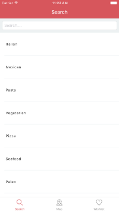

# mymenu

MyMenu iOS app

### Libraries

- AFNetworking
- CSStickyHeaderFlowLayout
- pop
- DZNEmptyDataSet
- PINCache
- ChameleonFramework
- SpinKit
- RMPZoomTransitionAnimator

### Supported Platforms

iOS 8+. Optimize

### Permission

To work fine we have to give location permissions.

### Run

Open workspace, and if necessary make pod update, in app directory.

### Prints

